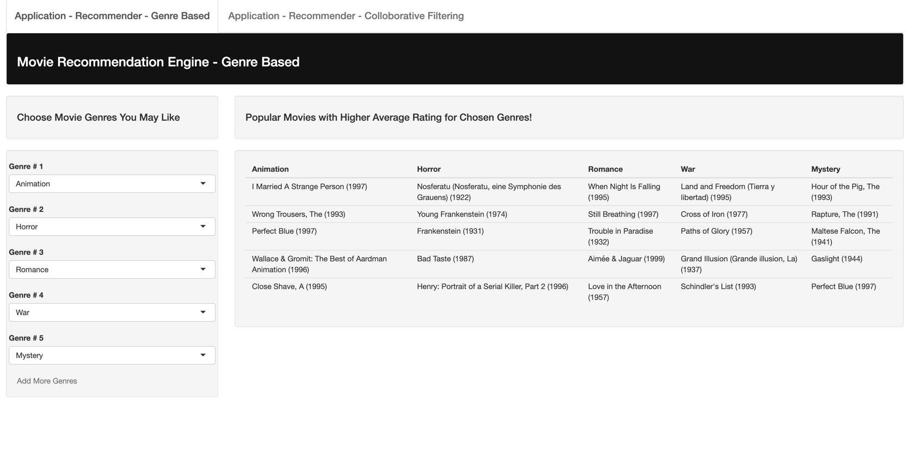
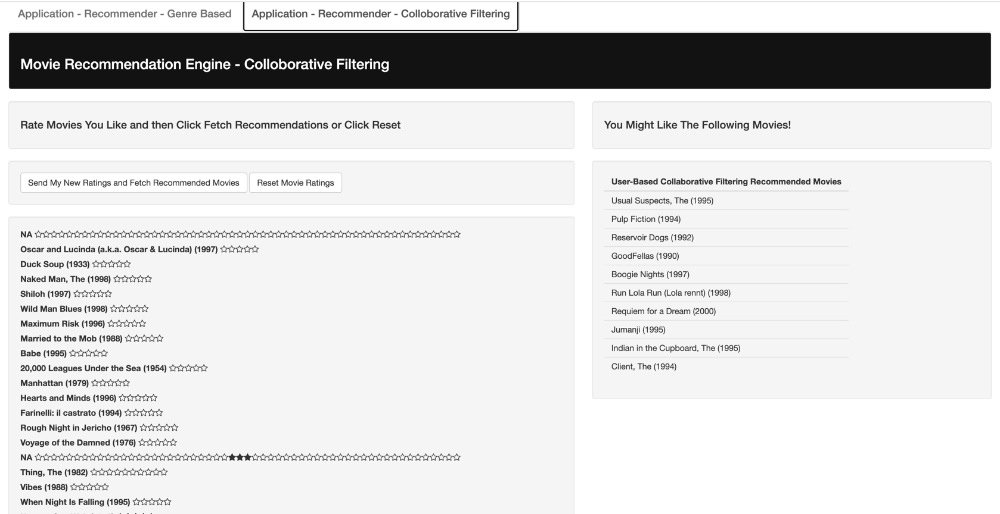

<!-- TABLE OF CONTENTS -->
<details open="open">
  <summary><h2 style="display: inline-block">Table of Contents</h2></summary>
  <ol>
    <li>
      <a href="#about-the-project">About The Project</a>
      <ul>
        <li><a href="#built-with">Built With</a></li>
      </ul>
    </li>
    <li>
      <a href="#getting-started">Getting Started</a>
      <ul>
        <li><a href="#prerequisites">Prerequisites</a></li>
        <li><a href="#installation">Installation</a></li>
      </ul>
    </li>
    <li><a href="#usage">Usage</a></li>
    <li><a href="#contact">Contact</a></li>
    <li><a href="#acknowledgements">Acknowledgements</a></li>
  </ol>
</details>

<!-- ABOUT THE PROJECT -->
## About The Project

System I is based on movie genres

- One scheme recommend top 5 popular movies in each user selected genres. Popularity is measured by the number of ratings a movie receives. A popular movie may not be a highly rated movie.

- The other scheme recommend 5 random movies in each user selected genres.

System II is based on collaborative filtering recommendation.

- One scheme uses user-based collaborative filtering technique to estimate missing movie ratings based on other similar users ratings. Once missing movie ratings are estimated, movies with highest ratings is recommended at the top.

- The other scheme uses item-based collaborative filtering technique to estimate missing movie ratings based on other movies similar to the onces that rated highly by the user. The most similar one is recommended to the top.

App I

App II


### Built With

* [R](R)
* [Recommenderlab](Recommenderlab)
* [Shiny](Shiny)
* [ShinyJS](ShinyJS)
* [DataTable](DataTable)
* [Reshape2](Reshape2)

<!-- GETTING STARTED -->
## Getting Started

To get a local copy up and running follow these simple steps.

### Prerequisites


* R (> 3.6.1)
* library(dplyr)
* library(ggplot2)
* library(recommenderlab)
* library(DT)
* library(data.table)
* library(reshape2)
* library(recommenderlab)
* library(Matrix)
* library(tidytable)
* library(knitr)
* library(shiny)
* library(shinyjs)
* library(shinyratinginput)


### Installation

1. Clone the repo
   ```sh
   git clone https://github.com/bvenkatr10/movie-recommendation.git
   ```
2. Install R packages
  ```sh
install.packages(c("dplyr","ggplot2","DT","data.table","reshape2","recommenderlab","Matrix","tidytable","knitr","data.table","tidytable"))

install.packages(c("dplyr","rmarkdown","httpuv","shiny","shinythemes","shinycssloaders","shinyjs","shinyratinginput"))
   ```

<!-- USAGE EXAMPLES -->
## Usage

This is simple shinyapp for movie recommendation developed as part of Project 4 for course CS598-PSL.

[ui.R](ui.R)

[server.R](server.R)

[recommendation.R](recommendation.R)

From RStudio, Click 'Run App' button to start Shiny App
or
```sh
R -e "shiny::runApp('path to shinyapp')"
```
Run R Markdown:

Markdown File:  **Project_4_3102_bv10_Bhu Venkatraman.Rmd**

This file contains Movies, Users and Ratings Data Exploration Analysis and the process of model building.

For the purpose of running, we evaluated the model only once in this markdown file.
We added another markdown file: **FullMillionExecutioninParallel.RMD** which evaluates each model 10 times using parallel and foreach package to speed up the process.
<!-- Data-->
## Data
[Movie Rating Dataset](ratings.dat)

[Movie Movies Dataset](movies.dat)

[Movie Users Dataset](users.dat)

## Deployed App in AWS

We deployed our app in AWS cloud platform EC2 X.large which runs 4 CPU , 16GBRAM which runs on UBUNTU.

<a href="http://ec2-3-91-181-227.compute-1.amazonaws.com:3838/movie-recommendation/">View Demo</a>

<!-- CONTACT -->
## Contact

Bhuvaneswari Venkatraman - bv10@illinois.edu

Project Link: [https://github.com/bvenkatr10/movie-recommendation.git](https://github.com/bvenkatr10/movie-recommendation.git)

<!-- ACKNOWLEDGEMENTS -->
## Acknowledgements

* Thanks to Professor - Feng Liang and TAs
